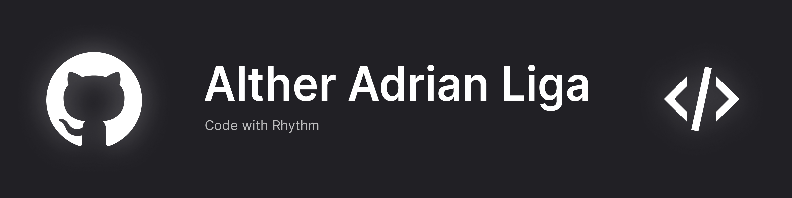
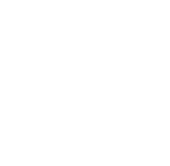
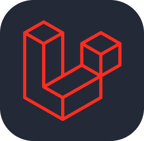

<!-- Banner with Particle Background -->

  

    
  

**3rd-Year BSIT Student | Database Track | Full-Stack Developer**

I am a passionate developer and database enthusiast currently pursuing a Bachelor's in Information Technology at the **University of Science and Technology of Southern Philippines**. I enjoy writing clean code and building efficient systems.

🔭 **Currently Working On:** [POS AI DB Manager](https://github.com/melody-sheep/POS-AI-DB-Manager) - AI-powered Point of Sale system with database management  
🌱 **Learning:** Database optimization, cloud technologies, system design, and networking  
🎯 **Goal:** Every line of code is an opportunity to learn something new. I embrace challenges as learning experiences and believe that mastery comes from continuous curiosity and hands-on practice.  
📫 **Reach Me:** [altheradrian@gmail.com](mailto:altheradrian@gmail.com) | 0962 694 8128 | Philippines

 
 

---

# 🚀 Featured Project: POS AI DB Manager

### **AI-Powered Point of Sale System with Database Management**

A full-stack Point of Sale system built with Laravel, featuring AI-powered insights and comprehensive database management capabilities. This system streamlines retail operations with intelligent inventory tracking, sales analytics, and role-based access control.

**Key Features:**
- 🤖 AI-powered sales predictions and inventory optimization
- 📊 Real-time analytics dashboard with visual reports
- 👥 Multi-role user management (Admin, Cashier, Manager)
- 🛒 Intuitive POS interface with quick transactions
- 📦 Automated inventory tracking and low-stock alerts
- 🔐 Secure authentication and role-based access
- 💾 Advanced database management with backup/restore
- 📱 Responsive design for desktop and tablet use

**Tech Stack:** Laravel • MySQL • Tailwind CSS • Alpine.js • Chart.js • REST APIs

[🔗 View Repository](https://github.com/melody-sheep/POS-AI-DB-Manager) | [📖 Live Demo](https://your-demo-link.com) | [📄 Documentation](https://your-docs-link.com)

---

# 🛠️ Tech Stack

### **Languages, Frameworks, Databases & Tools**

  
  
  
  
  
  
  
  
  
  
  
  
  
  
  
  
  
  
  
  
  
  

---

# 🎯 Currently Learning

  
  
  
  
  
  
  
  

---

# 📫 Connect With Me

  
  
  

<!-- Particle Effect Background -->

