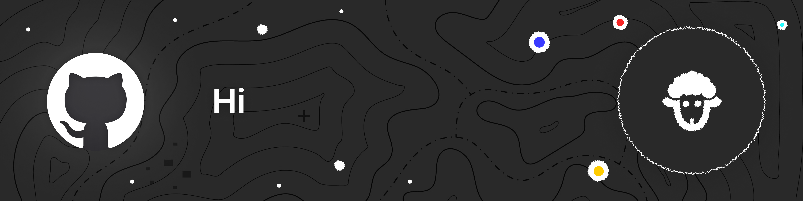

  

**3rd-Year BSIT Student | Database Track | Full-Stack Developer**

I am a passionate developer and database enthusiast currently pursuing a Bachelor's in Information Technology at the **University of Science and Technology of Southern Philippines**. I enjoy writing clean code and building efficient systems.

🔭 **Currently Working On:** [chemstock-app](https://github.com/melody-sheep/chemstock-app) - QR-Enabled Mobile Inventory System for Cospachem Products.

🌱 **Learning:** React Native, Expo, SQLite, and Mobile-First Database Optimization.

🎯 **Goal:** Become a proficient database administrator and full-stack developer.

📫 **Reach Me:** [altheradrian@gmail.com](mailto:altheradrian@gmail.com) | 0962 694 8128 | Philippines

  
  

---

# 🚀 Featured Project: ChemStock

### **QR-Enabled Mobile Inventory Management System**

ChemStock is an Android-based mobile inventory management system designed for **A and Aimee Laboratories (Cospachem Products)**. The system streamlines inventory operations for distributed sales forces by digitizing manual, paper-based processes into a centralized, efficient, and accountable digital platform.

**Key Features:**
- 📱 **Mobile Inventory Management:** Centralized digital platform for receiving, releasing, and returning stocks.
- 🔍 **QR-Based Tracking:** Scannable QR codes for each product batch to automate item identification and inventory checking.
- 📍 **Geo-Tagged Chain of Custody:** Captures GPS coordinates during stock release and receipt to verify handover locations.
- 📸 **Photo Documentation:** Mandatory timestamped photo evidence for stock handovers to resolve disputes.
- ⚠️ **Automated Discrepancy Alerts:** Real-time flagging of stock variances to minimize agent-level losses.
- 📊 **Customizable Reporting:** Automated inventory reconciliation for branch management and audits.

**Tech Stack:** React Native • Expo • SQLite • Express.js • QR Code Generation • Supabase • PostgreSQL

[🔗 View Repository](https://github.com/melody-sheep/chemstock-app)

---

# 🛠️ Tech Stack

### Languages, Frameworks, Databases & Tools

<table align="left">
  <tr>
    <td>  HTML5</td>
    <td>  CSS3</td>
    <td>  JavaScript</td>
    <td>  TypeScript</td>
    <td>  React JS</td>
    <td>  React Native</td>
    <td>  Node.js</td>
    <td>  Express.js</td>
  </tr>
  <tr>
    <td>  Next.js</td>
    <td>  Python</td>
    <td>  Java</td>
    <td>  C</td>
    <td>  C++</td>
    <td>  SQLite</td>
    <td>  PostgreSQL</td>
    <td>  Supabase</td>
  </tr>
  <tr>
    <td>  Git</td>
    <td>  Figma</td>
    <td>  VS Code</td>
    <td>  GitHub</td>
    <td>  Android</td>
    <td>  Firebase</td>
    <td>  Tailwind CSS</td>
    <td>  Slack</td>
  </tr>
</table>

 

---

# 🎯 Currently Learning

<table align="left">
  <tr>
    <td>  React Native</td>
    <td>  TypeScript</td>
    <td>  Tailwind CSS</td>
    <td>  SQLite</td>
    <td>  PostgreSQL</td>
    <td>  Express.js</td>
    <td>  Supabase</td>
    <td>  Expo</td>
  </tr>
</table>

 

---

# 📫 Connect With Me

<table align="left">
  <tr>
    <td>  LinkedIn</td>
    <td>  Gmail</td>
    <td>  GitHub</td>
  </tr>
</table>

 

---
